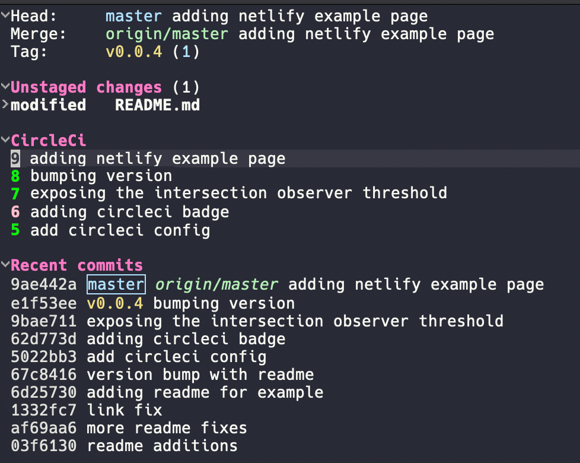

# magit-circleci

Magit extension for CircleCI. See the latest builds from the Magit status buffer.



## Setup
Get your token (https://circleci.com/docs/api/#add-an-api-token) and shove it as
```
(setq magit-circleci-token "XXXXXXXX")
```
or set it as environment variable `CIRCLECI_TOKEN`.

## Usage
```
M-x magit-circleci-mode : to activate
C-c C-o OR RET : to visit the build at point
" : in magit status to open the CircleCI Menu
" f : to pull latest builds for the current repo
```

## Customization
  * If you use CircleCI enterprise, you can change your host by editing `magit-circleci-host`.
  * By default, the extension fetches and shows the last 5 builds, you can change that by customizing the `magit-circleci-n-builds' variable.

## TODO
  * retry a build
  * cancel build
  * build cache persistence between sessions
  * show build output/failure
